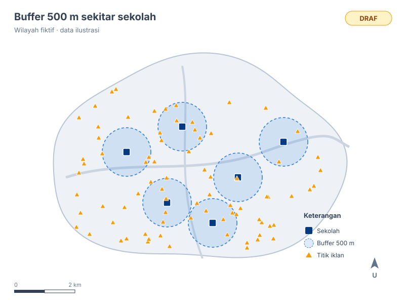

::: {.hero}

::: {.hero-text}
[EPIDEMIOLOGY & HEALTH DATA CONSULTING]{.eyebrow}

# [Evidence]{.hl} Starts With Better Data.

::: {.lead}
NUMERA membantu mengolah, menganalisis, dan memvisualisasikan data kesehatan menjadi insight yang mendukung penelitian dan keputusan berbasis bukti.
:::

::: {.hero-cta}
[Lihat Proyek](proyek.qmd){.btn-brand}
[Kenali Tim](tim.qmd){.btn-ghost}
:::
:::

::: {.hero-visual}
[Contoh luaran · peta tematik]{.kpi-label}

<!--
SLIDESHOW PETA
- Ganti gambar di folder assets/peta/ (boleh .png/.jpg/.svg; rasio ideal 4:3).
- Tambah/kurangi peta dengan menyalin atau menghapus satu blok <figure> di bawah.
- Tulis keterangan singkat di <figcaption> dan teks alternatif di alt="".
-->
```{=html}
<div class="map-slider" data-interval="5000" aria-roledescription="carousel" aria-label="Contoh peta tematik">
  <figure class="map-slide is-active">
    
    <figcaption>Insiden per wilayah · <em>draf</em></figcaption>
  </figure>
  <figure class="map-slide">
    
    <figcaption>Sebaran titik kasus · <em>draf</em></figcaption>
  </figure>
  <figure class="map-slide">
    
    <figcaption>Buffer 500 m sekitar sekolah · <em>draf</em></figcaption>
  </figure>
  <div class="map-dots" role="tablist"></div>
</div>
<script>
(function () {
  document.querySelectorAll(".map-slider").forEach(function (el) {
    var slides = el.querySelectorAll(".map-slide");
    var dotsBox = el.querySelector(".map-dots");
    var i = 0, timer = null, ms = +el.dataset.interval || 5000;
    var reduce = window.matchMedia("(prefers-reduced-motion: reduce)").matches;
    var dots = Array.prototype.map.call(slides, function (s, k) {
      var b = document.createElement("button");
      b.type = "button"; b.setAttribute("aria-label", "Tampilkan peta " + (k + 1));
      b.addEventListener("click", function () { show(k); restart(); });
      dotsBox.appendChild(b); return b;
    });
    function show(k) {
      slides[i].classList.remove("is-active"); dots[i].classList.remove("is-active");
      i = (k + slides.length) % slides.length;
      slides[i].classList.add("is-active"); dots[i].classList.add("is-active");
    }
    function start() { if (!reduce && slides.length > 1) timer = setInterval(function () { show(i + 1); }, ms); }
    function stop() { clearInterval(timer); timer = null; }
    function restart() { stop(); start(); }
    dots[0] && dots[0].classList.add("is-active");
    el.addEventListener("mouseenter", stop); el.addEventListener("mouseleave", start);
    el.addEventListener("focusin", stop); el.addEventListener("focusout", start);
    start();
  });
})();
</script>
```
:::

:::

<!-- Angka dirangkum dari CV anggota (per September 2026). Perbarui bila ada tambahan. -->
::: {.stats}
::: {.stat}
[9]{.stat-num}
[artikel jurnal ilmiah terbit]{.stat-label}
:::
::: {.stat}
[12]{.stat-num}
[buku kesehatan disunting]{.stat-label}
:::
::: {.stat}
[25+]{.stat-num}
[penelitian yang didukung]{.stat-label}
:::
::: {.stat}
[3]{.stat-num}
[Magister Epidemiologi]{.stat-label}
:::
:::

::: {.section-head}
## Layanan
:::

::: {.services}
::: {.service}
[<i class="bi bi-clipboard2-data"></i>]{.icon}

### Analisis data survei kesehatan
Analisis data sekunder SKI, SDKI, dan Riskesdas dengan desain survei kompleks — dari
estimasi prevalensi sampai regresi logistik multivariabel.
:::
::: {.service}
[<i class="bi bi-geo-alt"></i>]{.icon}

### Epidemiologi spasial & lingkungan
Peta tematik, kernel density, dan analisis buffer dengan QGIS, serta analisis hubungan paparan
lingkungan (mis. polusi udara dan iklim) dengan penyakit menggunakan DLNM.
:::
::: {.service}
[<i class="bi bi-speedometer2"></i>]{.icon}

### Dashboard surveilans
Dashboard interaktif dengan R Shiny dan Quarto untuk memantau data kasus rutin secara berkala.
:::
::: {.service}
[<i class="bi bi-journal-text"></i>]{.icon}

### Pendampingan riset & pelatihan
Pendampingan pengolahan data dan penulisan manuskrip, serta pelatihan R dan QGIS untuk
tenaga kesehatan.
:::
:::

::: {.section-head}
## Proyek terbaru
[Semua proyek →](proyek.qmd)
:::

::: {#proyek-unggulan}
:::

::: {.cta}
## Punya data kesehatan yang perlu dianalisis?
Ceritakan pertanyaan penelitian atau kebutuhan program Anda. Kami bantu menentukan analisis
yang tepat sebelum mulai mengolah data.

[Hubungi Kami](mailto:falah@numera.org){.btn-brand}
:::
