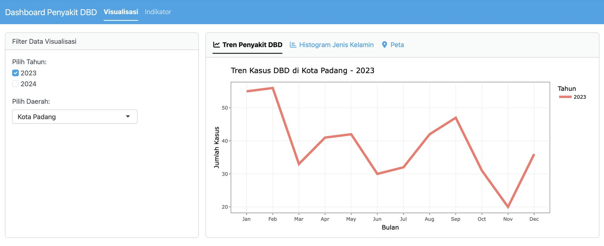
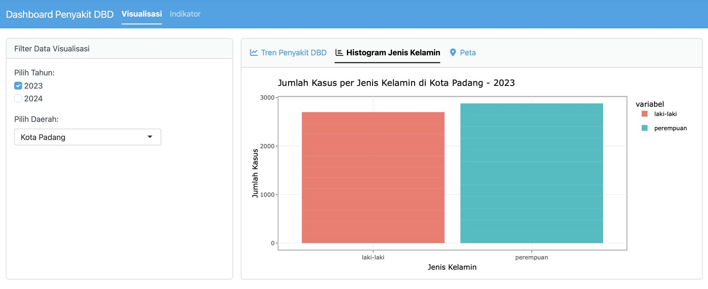
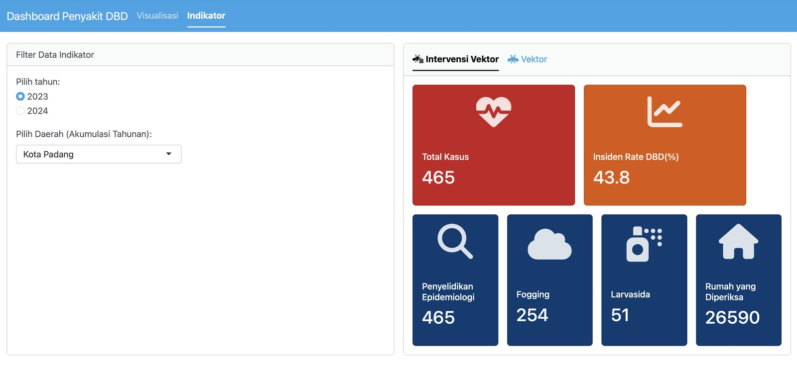
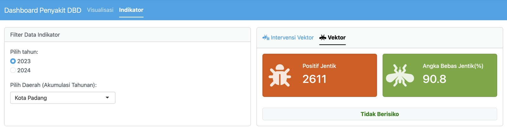

::: {.project-meta}
::: {}
[Tahun]{.label}

[2025]{.value}
:::
::: {}
[Peran]{.label}

[Analis data]{.value}
:::
::: {}
[Mitra]{.label}

[Dinkes Kota Padang]{.value}
:::
::: {}
[Data]{.label}

[Kasus & vektor DBD 2023–2024]{.value}
:::
:::

::: {.callout-tip}
## Coba dashboard-nya
Dashboard ini sudah dipublikasikan dan bisa dibuka langsung:

[Buka Dashboard DBD ↗](https://ibasgo.shinyapps.io/Dashboard-DBD-2024/){.btn-brand}

[Dihosting di shinyapps.io. Jika aplikasi sedang "tertidur", tunggu beberapa detik hingga termuat.]{.muted}
:::

## Latar belakang

Data surveilans demam berdarah dengue (DBD) dilaporkan secara rutin, tetapi sering hanya
tersimpan dalam tabel. Dashboard membantu petugas melihat tren dan sebaran kasus dengan cepat.

## Isi dashboard

Pengguna memilih **tahun** (2023, 2024) dan **wilayah**, lalu melihat dua menu:

- **Visualisasi** — tren kasus DBD per bulan, distribusi kasus menurut jenis kelamin, dan peta sebaran kasus.
- **Indikator** — total kasus dan insiden rate; **intervensi vektor** (penyelidikan epidemiologi,
  fogging, larvasida, rumah yang diperiksa); serta **indikator vektor** (jumlah positif jentik dan
  angka bebas jentik) beserta status risikonya.

{.dash-shot group="dashboard"}

<!--
Tangkapan layar lain sudah tersedia di folder ini. Aktifkan setelah perbaikan di dashboard:
{.dash-shot group="dashboard"}
{.dash-shot group="dashboard"}
{.dash-shot group="dashboard"}
-->

## Peran tim

Selama studi lapangan di **Bidang Surveilans Epidemiologi Dinas Kesehatan Kota Padang**
(September – Oktober 2025), Muhammad Ilham Basgoro menganalisis data rutin DBD dan SKDR serta
membangun dashboard surveilans DBD dengan **R Shiny**.

## Kegiatan terkait

- Investigasi dan respons KLB **campak** dan **pertusis**.
- Peta kasus campak, difteri, rabies, dan pertusis serta **peta cakupan imunisasi** dengan QGIS.
- Pelaksanaan *Transmission Assessment Survey* (TAS) filariasis.

## Luaran

- [Dashboard surveilans DBD](https://ibasgo.shinyapps.io/Dashboard-DBD-2024/) berbasis R Shiny (daring), data 2023–2024.
- Peta kasus penyakit dan cakupan imunisasi untuk Bidang Surveilans Epidemiologi.
